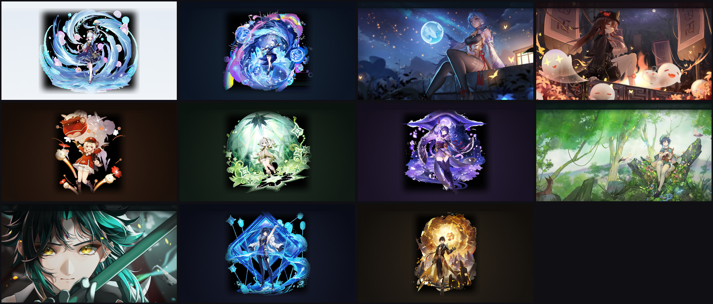

# Omarchy Genshin Themes 原神主题包

为 [Omarchy](https://omarchy.org/)（Arch + Hyprland 发行版）打造的原神角色主题，
11 位角色 × 深浅双模式，全部 4K 壁纸，透明状态栏实测可读。



## 主题一览

| 主题 | 角色 | 元素/地区 | 模式 | 主配色 |
|---|---|---|---|---|
| `raiden-shogun` | 雷电将军 | 雷 · 稻妻 | 深色 | 紫电 + 薰衣草 + 鎏金 |
| `ganyu` | 甘雨 | 冰 · 璃月 | 深色 | 冰川蓝 + 冰晶青 |
| `hu-tao` | 胡桃 | 火 · 璃月 | 深色 | 绛梅 + 朱砂 + 鎏金 |
| `zhongli` | 钟离 | 岩 · 璃月 | 深色 | 玄岩 + 琥珀金 |
| `nahida` | 纳西妲 | 草 · 须弥 | 深色 | 深林 + 净草绿 |
| `venti` | 温迪 | 风 · 蒙德 | 深色 | 深青 + 清风青绿 |
| `furina` | 芙宁娜 | 水 · 枫丹 | 深色 | 深海蓝 + 水神青金 |
| `ayaka` | 神里绫华 | 冰 · 稻妻 | **浅色** | 霜白 + 冰蓝 + 樱色 |
| `xiao` | 魈 | 风 · 璃月 | 深色 | 玄墨 + 翠玉金 |
| `yelan` | 夜兰 | 水 · 璃月 | 深色 | 靛夜 + 星蓝 |
| `klee` | 可莉 | 火 · 蒙德 | 深色 | 暖夜 + 火花珊瑚 + 金 |

每个主题包含：

- `colors.toml` — 完整调色板（18 语义色 + 4 层背景），顶部有设计思路注释
- `icons.theme` — 配套 Yaru 图标色
- `backgrounds/1-<角色>.jpg` — 3840×2160 主题壁纸
- `backgrounds/2-abstract.jpg` — 同色系纯渐变壁纸（`omarchy theme bg next` 切换）

## 安装

```bash
git clone https://github.com/jasper-nan/omarchy-genshin-themes.git
cd omarchy-genshin-themes
./install.sh                 # 复制到 ~/.config/omarchy/themes/

omarchy theme list           # 确认出现
omarchy theme set "Hu Tao"   # 试试胡桃
```

> 也可以只复制单个主题：`cp -r themes/hu-tao ~/.config/omarchy/themes/`

## 透明栏可读性

每张壁纸顶部叠有 260px 的主题底色渐变暗带（底部 150px）。这样即使
`shell.json` 里 `"transparent": true`（文字直接压壁纸），Omarchy 的
`omarchy-bar-text-color` 采样也永远命中深色区。11 个主题实测对比度
8.5:1 ~ 15:1（WCAG AAA 标准 7:1）。

## 改配色 / 重制壁纸

1. 编辑 `themes/<slug>/colors.toml`（各键含义见文件内注释）
2. 如需重制壁纸：把角色原图放 `themes/<slug>/src/art.png`，运行
   `bin/compose-wallpapers.sh themes/<slug> <slug> compose`
3. `omarchy theme set <主题名>` 重新应用

## 致谢与版权声明

- 配色、合成脚本以 [MIT](LICENSE) 开源
- 壁纸素材基于米哈游《原神》官方角色立绘及社区壁纸二次合成，
  © miHoYo / HoYoverse。本项目为非商业粉丝作品，与 miHoYo / HoYoverse
  无关联，不官方授权。若权利方要求，将立即下架相关素材。
- 部分壁纸素材来自搜图神器聚合的社区资源，感谢原作者。
